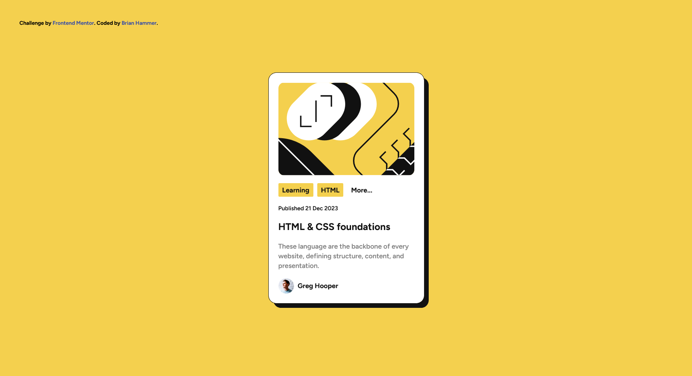
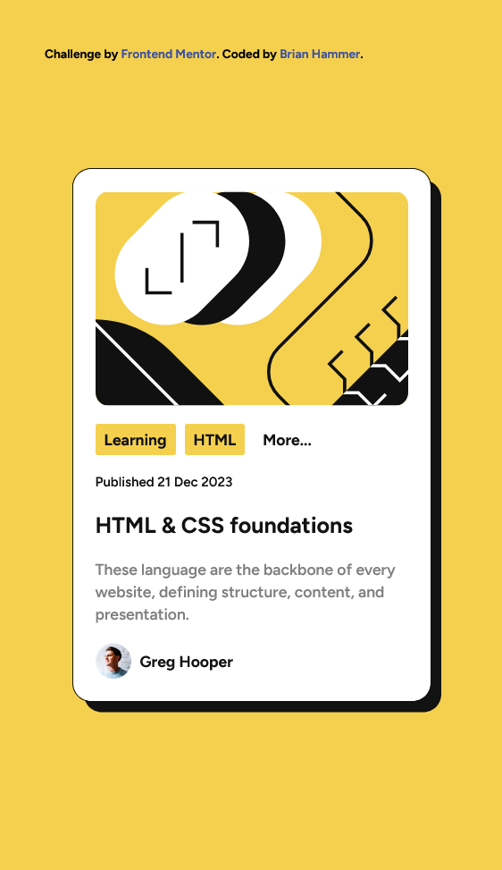

# Frontend Mentor - Blog preview card solution

This is a solution to the [Blog preview card challenge on Frontend Mentor](https://www.frontendmentor.io/challenges/blog-preview-card-ckPaj01IcS). Frontend Mentor challenges help you improve your coding skills by building realistic projects.

## Table of contents

- [Overview](#overview)
  - [The challenge](#the-challenge)
  - [Screenshot](#screenshot)
  - [Links](#links)
- [My process](#my-process)
  - [Built with](#built-with)
  - [What I learned](#what-i-learned)
  - [Continued development](#continued-development)
- [Author](#author)

## Overview

A blog UI component made with Tailwind.

### The challenge

Users should be able to:

- See hover and focus states for all interactive elements on the page

### Screenshot

Desktop View


Mobile View


### Links

- Live Site URL: [Add live site URL here](TO_BE_ADDED)

## My process

Built with tailwind. I put many of the colors layed out in the style-guide inside tailwind.config. Set the 'content' setting to the ./index.html path. Whenever edits need to be made, I run the following command:

``` npx tailwindcss -i ./input.css -o ./output.css --watch ```

I view my edits using live server.

### Built with

- Tailwind
- HTML
- Flex containers

### What I learned

I learned more about making custom shadows, and importing them into tailwind. I also learned about tailwind's outline class. 

### Continued development

If I were to continue working on this component, I would likely add more hover effects to the categories section. I would also make it so hovering over text does not make the cursor an "I" shape because the purpose is to click on the article.

## Author

- Website - [Brian Hammer](TO_BE_ADDED)
- Frontend Mentor - [@brianhammer](https://www.frontendmentor.io/profile/brianhammer)
